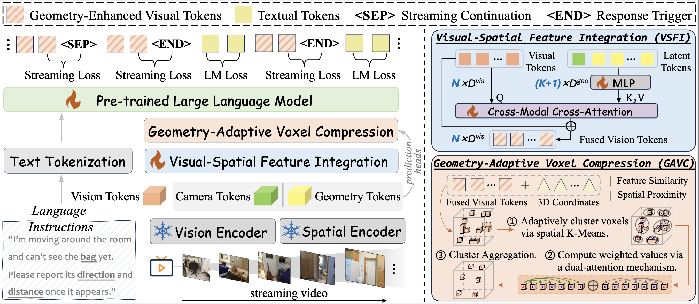
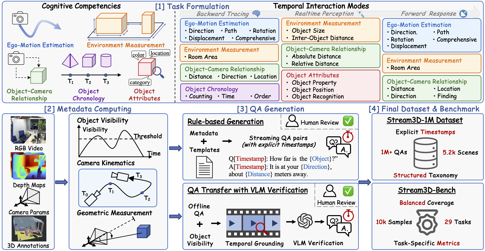

<h1 align="center" style="display: flex; align-items: flex-start; justify-content: center; gap: 12px;">
  <strong>
    Stream3D-VLM: Online 3D Spatial Understanding<br>
    with Incremental Geometry Priors
  </strong>
</h1>

<p align="center">
    <a href="https://hanxunyu.github.io/" target="_blank">Hanxun Yu<sup>1,2*</sup></a>,
    <a href="https://github.com/Select-ing" target="_blank">Xuan Qu<sup>1,2*</sup></a>,
    <a href="https://www.kelei.site/" target="_blank">Lei Ke<sup>2</sup></a>,
    <a href="https://cyrilsterling.github.io/" target="_blank">Boqiang Zhang<sup>2</sup></a>,
    <a href="https://w-ted.github.io/" target="_blank">Yuxin Wang<sup>2,3</sup></a>,
    <a href="https://person.zju.edu.cn/jkzhu" target="_blank">Jianke Zhu<sup>1</sup></a>,
    <a href="https://dongyu888.github.io/" target="_blank">Dong Yu<sup>2</sup></a>
    <br>
    <sup>1</sup>ZJU,
    <sup>2</sup>Tencent AI Lab,
    <sup>3</sup>HKUST
</p>

<div align="center">
    <a href='https://arxiv.org/abs/2512.16561' target="_blank"></a>  
    <a href='' target="_blank"></a>  
    <a href='' target="_blank">
        
    </a>
    <a href='' target="_blank">
        
    </a>
</div>

https://github.com/user-attachments/assets/a2788b03-6eb1-4e18-ad0a-904e6a408992


## 🔍 Overview

<div align="left">

</div>

**Stream3D-VLM** is an online 3D vision-language model that supports real-time spatial understanding and interaction directly from streaming video. By incrementally integrating geometry priors and employing geometry-adaptive token compression, our approach enables efficient and continuous 3D scene comprehension without requiring offline processing or complete scene observations.


## 📰 News

- **`2026/02/19`**: We released this repo with the pre-trained model and inference code.


## 🛠️ Installation

```
git clone https://github.com/hanxunyu/Stream3D-VLM.git
cd Stream3D-VLM

conda create -n stream3d-llm python=3.10 -y
conda activate stream3d-llm
pip install -r requirements.txt
pip install flash-attn==2.7.4.post1 --no-build-isolation
export PYTHONPATH=$(pwd)/src:$PYTHONPATH
```
## 📊 Datasets and Benchmarks
<div align="left">

</div>

**Illustration of our data generation pipeline.** Guided by a comprehensive task taxonomy spanning five cognitive competencies and three temporal interaction modes, the pipeline leverages detailed metadata from RGB-D video streams and a hybrid generation strategy to construct a large-scale spatio-temporal 3D QA dataset and the Stream3D-Bench for evaluating online 3D spatial understanding.

We provide the training dataset and **Stream3D-Bench** [XXXX](https://huggingface.co/yuxinhk/N3D-VLM) in Hugging Face 🤗. 

## 📦️ Pre-trained models
We provide the pre-trained models [XXXX](https://huggingface.co/yuxinhk/N3D-VLM) in Hugging Face 🤗. 

## 🚀 Training
```
# train 
python train.py
```

## 🤖 Inference 
```
# inference 
python inference.py
```

### Demo 1-Forward Response (Monitoring)


https://github.com/user-attachments/assets/a3af0dab-6c39-48b9-a43d-41596e4ceb57


### Demo 2-Realtime Perception (Observation)


https://github.com/user-attachments/assets/04a945b7-3c8d-4305-bd9a-0e7ca5fac45c


### Demo 3-Backward Tracing (Memory)


https://github.com/user-attachments/assets/091e1687-7e35-42f7-83c9-a53a378ccda3


## 📄 License

This project is licensed under the Apache License 2.0 - see the [LICENSE](LICENSE) file for details.


## 🖊️ Citation

```BibTeX

```


